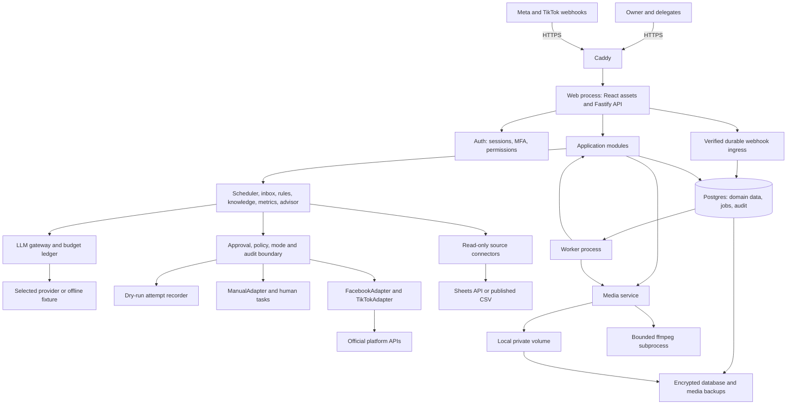

# Helpa architecture

Status: accepted design with local Phases 0–5 implemented, 2026-09-08. See the phase delivery guides for exact implementation and remaining live-account acceptance. See [ADRs](adr/README.md) and [open decisions](OPEN_QUESTIONS.md).

## Stack and deployment

Use TypeScript throughout: React/Vite UI served by a Fastify Node.js web process, a separate Node.js worker built from the same repository, Postgres, pg-boss, and Caddy. Reviewed SQL migrations and native pg repositories implement the foundation; typed ORM adoption is deferred until it adds value to the feature modules; Zod validates external and internal boundaries. Better Auth supplies identity primitives with Helpa-owned authorization and mandatory MFA enforcement. Use ExcelJS for XLSX parsing, a direct ffmpeg/ffprobe subprocess wrapper, i18next, Vitest, and Playwright. Validate/pin supported versions, licenses, and security posture in Phase 0; these are library choices, not claims about compatibility already tested.

One origin avoids cross-origin auth complexity. One database avoids Redis operations at this scale. Core modules contain no platform SDK imports. ChannelAdapter now routes publication, webhook normalization/signature checks, replies, metric collection and credential maintenance. Its fetchInbox consumes verified webhook envelopes; it does not pretend to poll unavailable APIs. Web and worker share application services and DTOs, not request handlers. FFmpeg concurrency starts at one with CPU/memory/time limits; queue priorities protect replies from long transcodes. The production image is built before deployment so the small VPS need not run a frontend build under load.

Deployment services: `app`, `worker`, `postgres`, `caddy`, plus a one-shot migration task. Backup execution is a documented scheduled maintenance task, not a second application. Only Caddy exposes public ports. Local HTTPS uses Caddy's local CA; production uses public DNS and automatic certificates. Local CA trust does not make localhost reachable by Meta/TikTok.

## Module contracts

| Module          | Owns                                                      | Boundary                                                                       |
| --------------- | --------------------------------------------------------- | ------------------------------------------------------------------------------ |
| auth            | identities, sessions, invitations, memberships, MFA       | Verified actor context; business/permission/channel checked for each operation |
| channels        | OAuth, secret storage, webhook verification, capabilities | Provider-specific transport and documented capability errors only              |
| scheduler       | posts, variants, recurrence, approvals, dispatch jobs     | Frozen revision and UTC due time                                               |
| inbox           | normalized conversations/messages, drafts, assignments    | Channel-independent message and reply commands                                 |
| rules           | validated YAML and immutable versions                     | Deterministic decisions with reason codes                                      |
| knowledge       | connectors, mapping, sync runs, versioned records         | Typed factual assertions with provenance and freshness                         |
| llm             | classify/extract/rephrase/summarize, usage ledger         | Strict schemas; cannot perform business actions or grant permissions           |
| metrics/advisor | immutable snapshots, aggregates, evidence/proposals       | No automatic application of advice                                             |
| audit           | sensitive events, outbound payload history                | Append-only application access; failure blocks new dispatch                    |

`ChannelAdapter` operations: `publish`, `fetchInbox`, `sendReply`, `fetchMetrics`, `verifyWebhook`, `refreshCredentials`, `capabilities`. Each receives a business/channel context and returns a typed result including delivery state, external ID when known, retryability, and reason. Capability descriptors are per operation/content type, not one boolean for a whole platform. Core decides dispatch eligibility; adapters revalidate transport-specific prerequisites.

`ManualAdapter` returns a manual outcome that the dispatcher records as a tracked human task with copy/download controls, never a fabricated remote success. Pasted inbound messages use the same pipeline. Manual completion records the human actor and optional evidence/permalink, clearly distinguished from API confirmation. Platform token reads are private to adapter/credential services.

## Data model and invariants

Every tenant-scoped row has a non-null `business_id`; cross-table references use composite foreign keys `(business_id, id)` where relevant. Global auth identity/session tables and pg-boss infrastructure are explicit exceptions; jobs carry a business ID and domain reference, not unscoped business data. An identity can have memberships in future businesses without changing identity ownership.

All business timestamps use Postgres `timestamptz`. Money uses decimal amounts plus currency; quantities include units. Human-facing records use tombstones/soft-delete; immutable record revisions and audit evidence survive source deletion. Tenant-filtered repositories and negative integration tests enforce scope; PostgreSQL RLS can be added later as defense in depth rather than silently relying on untested pooled-connection context.

| Entities                                          | Key fields and relations                                                                                                                                                        |
| ------------------------------------------------- | ------------------------------------------------------------------------------------------------------------------------------------------------------------------------------- |
| Business                                          | name, business timezone, mode settings, approval setting, automation pause/version, voice profile/version, retention                                                            |
| User / Identity / Session / MFA                   | verified contact identities, UI locale/timezone; revocable sessions, MFA status/time, device metadata; no business authority in a client token                                  |
| Membership                                        | business + user unique, role, channel scope, optional subtractive permissions, status/revocation/version                                                                        |
| Invitation / OnDutyShift / NotificationPreference | hashed single-use invite, intended recipient/role/scope, expiry; weekday/timezone shifts; delivery preferences                                                                  |
| Channel / ChannelCredential                       | platform/external ID unique per business, name, per-operation capabilities and verified-at, transport mode; private ciphertext, wrapped key, key version, expiry/refresh status |
| MediaAsset / MediaRendition                       | content hash, original path/MIME/size, metadata; spec version, derived path/hash, processing state                                                                              |
| Post / PostVariant / VariantRevision / PostMedia  | shared content/media relationships; per-channel captions/type/time/state; immutable payload revision and approval digest                                                        |
| RecurringTemplate / PublishJob                    | local recurrence, timezone, template revision; unique occurrence key; variant revision, due time, attempt, operation key                                                        |
| OutboundOperation / OutboundAttempt               | unique logical effect key, substep, mode, frozen payload/hash, actor, intent, factual evidence, policy checks, request/response, delivery outcome                               |
| Conversation / Message / WebhookReceipt           | channel+external-thread uniqueness; channel+external-message/event uniqueness, message origin/time, last customer-interaction time, raw-body digest and processing state        |
| IntentResult                                      | message, intents, confidence per intent, typed entities, model/prompt version, extraction evidence                                                                              |
| Rule / RuleVersion / BrandVoiceVersion            | validated YAML/voice content, immutable revision, actor, activation timestamp                                                                                                   |
| KnowledgeSource / SyncRun / DatasetPolicy         | connector config, mapping/version, source priority, staged validation; row/error counts; per-field freshness limits                                                             |
| KnowledgeRecord / KnowledgeRecordVersion          | stable canonical key (SKU/zone/order etc.), source row reference; immutable canonical JSON, content hash, source fact timestamps, synced_at, validity interval                  |
| ReplyDraft / FactUse / HumanEdit                  | incoming message, text/revision, autonomy/reasons, check results; exact record version/field/value/unit/provenance; draft/final pair                                            |
| Approval / ApprovalRequest                        | typed target FK to variant revision or draft revision, decision/actor/time, approved hash; assigned user, created/due timestamps and state                                      |
| AuditEvent                                        | actor user/rule/automation, action/resource/channel, safe exact payload reference, before/after metadata, correlation ID, timestamp                                             |
| LlmCall / BudgetReservation                       | operation/provider/model, encrypted prompt/response reference, tokens/rate version/cost, reservation/finalization state and billing month                                       |
| Notification / DeliveryAttempt                    | target user, type/channel, dedup key, attempt, provider outcome                                                                                                                 |
| MetricSnapshot / Insight / Proposal               | channel/post/date/metric/value/unit/source and capture time; detector version/window/counts/IDs; human-reviewable change                                                        |

Approvals have a checked typed target relation, not an unchecked generic ID. `FactUse` records the field value as used and points to an immutable version. Outbound evidence includes LLM call IDs and exact prompt/response where applicable; credentials/authorization headers never enter payload previews. Audit records are protected against app-level update/delete and retained at least 12 months; this is not a claim of tamper-proof storage against a database administrator.

Indexes cover business/channel/time/status for inbox/jobs/audit; channel external identifiers for deduplication; normalized product names/aliases and SKU for lookup; snapshot date/channel for reporting. Do not create the entire future schema in Phase 0: introduce these records with the vertical slice that owns them.

## Outbound trust boundary

Content publishing and customer replies use dedicated dispatchers with the same authorization, dry-run, audit and idempotency invariants. There is no direct HTTP escape from feature modules to a platform write endpoint.

1. Resolve current membership, role, scope, channel capability, and business settings. Recheck the initiating delegate and approval authority at dispatch; revoked actors cannot leave active pending work behind.
2. Verify approved revision/hash and due time. Recheck freshness and customer messaging eligibility now, not just when a draft was created. Changed facts, edits, or tightened policy invalidate eligibility.
3. Freeze the semantic outbound payload, factual provenance, initiator, prompt references, and policy/mode snapshot. Persist the operation intent and audit event before transport; fail closed if persistence fails.
4. Compute effective mode: global dry-run overrides every channel; a manual capability produces a task; only explicit live plus a live capability can call transport. Automation pause suppresses all automatic replies including holding replies; a separate operational pause can stop every scheduled action. Human sends still obey policy.
5. Dry-run records `would_have_sent` with no remote content/media mutation. Do not resolve signed upload URLs by calling the remote platform in dry-run; log the exact semantic request plus unresolved server-generated transport fields honestly.
6. Live transport records confirmed outcomes or unknown outcome. A connection timeout after sending is **not** proof of failure. Reconcile by documented status/external IDs, or leave `needs_action` without automatic resubmission.

OAuth connection/token maintenance and approved read-only pulls are allowed in dry-run to support real-data testing; the mode banner explains that distinction. Email/SMS have a separate dev/live notification setting. Tests default to local capture to avoid external notifications. Enabling live cannot convert prior dry-run operations into live work.

Post lifecycle remains `draft → scheduled → publishing → published | failed | needs_action`. Approval is orthogonal. `published` is reserved for confirmed live publication. Dry-run completion and inbox-upload/manual handoff use `needs_action` plus a specific delivery outcome; UI distinguishes successful simulation from a failure. Retries are per effect: media initialization, upload, publication, and first-comment have distinct state so a failed comment cannot duplicate a post.

## Inquiry pipeline and factual integrity

Treat incoming messages, sheet notes, and LLM outputs as untrusted data. The model has no tools to send messages or read credentials. Classification and extraction return strict bounded schemas with multi-intent support and evidence spans. Language is selected per message; uncertain language/classification produces a draft. A complaint overrides otherwise answerable intents; spam produces no holding reply.

Rules choose requirements and autonomy; the most restrictive applicable action wins. Product matching normalizes Unicode/diacritics (including đ), matches SKU/name/aliases and size/grade, and requires a unique plausible candidate; fuzzy score alone cannot erase ambiguity. Add explicit size/grade fields to the canonical mapping when product data needs them. Shipping location aliases map to an approved zone, never an LLM-invented province record. Orders require exact ID plus appropriate customer verification before revealing order details.

Source sync stages rows and commits a validated dataset atomically. Store `synced_at` separately from `source_updated_at` and field observation timestamps. Polling an old sheet must not refresh its stale facts. If a source lacks reliable timestamps, require an explicit owner-attested freshness workflow or mark it stale. Multiple sources with conflicting facts escalate unless a recorded owner-selected priority resolves them. Reject invalid currencies/units, future timestamps beyond a documented clock tolerance, and incomplete schemas with row-level diagnostics. Published CSV is allowed only for public non-sensitive data; never publish customer orders to obtain a zero-auth URL.

Composition first creates typed assertions: subject, predicate, value, unit, conditions, provenance, expiry. Deterministic locale templates render these assertions. An LLM can select approved greeting/sign-off/phrasing variants and propose rephrasing, but arbitrary free text is draft-only. Auto-send is restricted to an approved template grammar with fact slots, making factual clauses mechanically reconstructable from the same assertions. This narrows the brief's free-form rephrasing to meet its stronger “never guess” requirement.

The gate checks assertion identity and relationships, units, qualifiers, negation, quantities, product/place names and numbers; it is not just token membership. Each factual clause must map to a fact or approved policy/FAQ version. Approved templates may supply grammar and greetings, not fresh price/stock claims. Extra or omitted assertions and forbidden claims downgrade to approval. Origin/quality claims require explicit approved provenance; the model cannot decide that raw supplier text is approved. Numeric-only/LLM-only gates cannot prove this invariant. No deterministic design can establish that the source itself is true; source accuracy remains the business's responsibility.

Freshness, ambiguity, confidence, forbidden claims, budget failure, platform policy and duplicate suppression are independent gates. Missing any required fact in a multi-intent message yields a holding reply/draft rather than a partially speculative answer. Humans see stale facts; customers do not. Human edits retain before/after text and rerun checks; failed drafts require editing or explicit approved knowledge correction before send. Automation disclosure and a human contact path are approved copy, subject to the current platform policy review.

## Security and operability

- Opaque server-side sessions; secure HttpOnly cookies, CSRF/origin checks; rate limits and OTP/invite consumption persisted in Postgres. Mandatory TOTP enforcement checks every auth method, not just the UI. See ADR-004 for passwordless limitations.
- Envelope encryption: random data key per credential, authenticated encryption with unique nonce and business/channel binding; wrap data key with versioned env/secret-store key. Rotation rewraps keys; backup the key material separately. Authorized metadata never exposes plaintext tokens. TOTP secrets and sensitive LLM/audit payloads receive appropriate at-rest protection too.
- Webhooks verify the exact raw bytes before parsing; apply provider-specific signature and timestamp rules only when documented, persist unique delivery IDs/digests, then acknowledge. No acknowledgement before durable receipt. Health tracks last valid event and failures.
- Media URLs are scoped, expiring and permission-checked. Validate source URLs against SSRF/private-network redirects, bound downloads/archive expansion, sniff files, disable spreadsheet formula execution, and constrain ffmpeg processes. Prefer approved provider hostlists for remote downloads.
- Logs carry correlation/business/operation IDs but redact tokens and customer-sensitive text. Separate minimal liveness from readiness and authenticated diagnostics. System surfaces worker heartbeat, due backlog, retries, unknown outcomes, sync freshness, webhook failures, token expiry, and LLM spend/cap.
- Daily encrypted off-host backup of database and media with a consistent manifest; retain at least 12 months of audit in the live/archive policy. Restore only into dry-run with workers paused, validate keys/references, reconcile post-backup remote effects before re-enabling live. Proposed RPO/RTO need measured validation.
- Adapter contracts and evidence distinguish unsupported metrics, restricted capabilities and manual operation. Documentation-access failures and TikTok eligibility are tracked in [API notes](API_NOTES.md).
